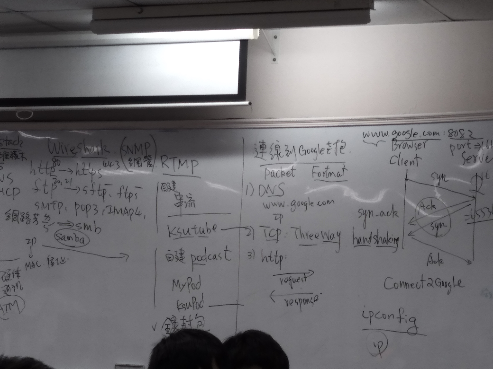

### OSI
(7).app---proxy L7 switch
(6).presentation
(5).session
(4).Transport ---port
(3).Networl---IP
(2).Data Link---MAC(在網卡上的實體位置 獨一無二)
(1).physical

Three Way Handshake---三向交握

### TCP---傳輸控制協定（英語：Transmission Control Protocol，縮寫：TCP）
是一種連接導向的、可靠的、基於位元組流的傳輸層通信協定，由IETF的RFC 793定義。在簡化的電腦網路OSI模型中，它完成第四層傳輸層所指定的功能。用戶資料報協定（UDP）是同一層內另一個重要的傳輸協定。
在網際網路協定族（Internet protocol suite）中，TCP層是位於IP層之上，應用層之下的中間層。不同主機的應用層之間經常需要可靠的、像管道一樣的連接，但是IP層不提供這樣的流機制，
而是提供不可靠的包交換。

### UDP---用戶資料報協定（英語：User Datagram Protocol，縮寫：UDP；又稱用戶資料包協定）
是一個簡單的面向資料報的通信協定，位於OSI模型的傳輸層。該協定由David P. Reed在1980年設計且在RFC 768中被規範。典型網路上的眾多使用UDP協定的關鍵應用在一定程度上是相似的。
在TCP/IP模型中，UDP為網路層以上和應用層以下提供了一個簡單的介面。UDP只提供資料的不可靠傳遞，它一旦把應用程式發給網路層的資料傳送出去，
就不保留資料備份（所以UDP有時候也被認為是不可靠的資料報協定）。UDP在IP資料報的頭部僅僅加入了復用和資料校驗欄位。
UDP適用於不需要或在程式中執行錯誤檢查和糾正的應用，它避免了協定棧中此類處理的開銷。對時間有較高要求的應用程式通常使用UDP，因為丟棄封包比等待或重傳導致延遲更可取。

### TCP|IP protocol(協定) stack(堆疊)

APP
(SSL)
Transport
Internetworking
Datalink  ARP協定

### DNS---網域名稱系統（英語：Domain Name System，縮寫：DNS）是網際網路的一項服務。它作為將域名和IP位址相互對映的一個分散式資料庫，能夠使人更方便地存取網際網路。DNS使用TCP和UDP埠53[1]。當前，對於每一級域名長度的限制是63個字元，域名總長度則不能超過253個字元。

